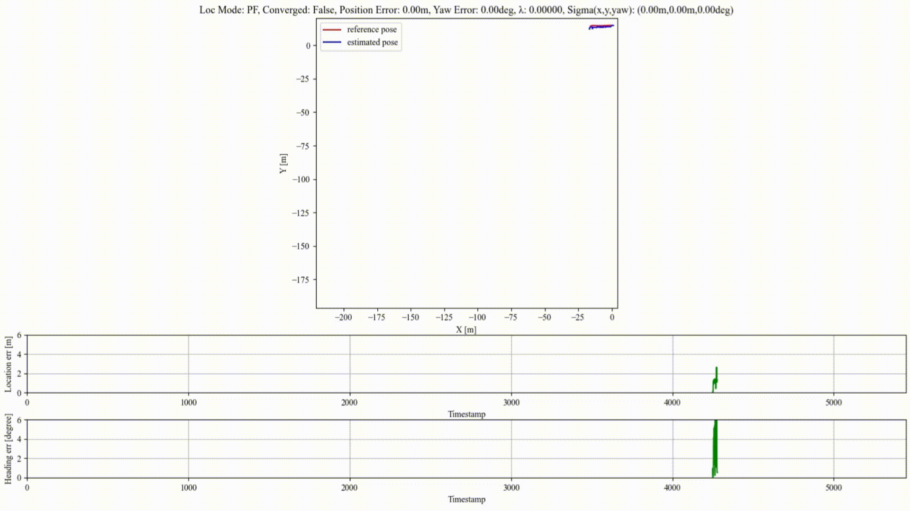
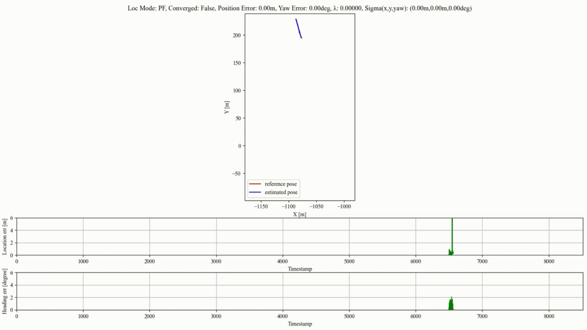
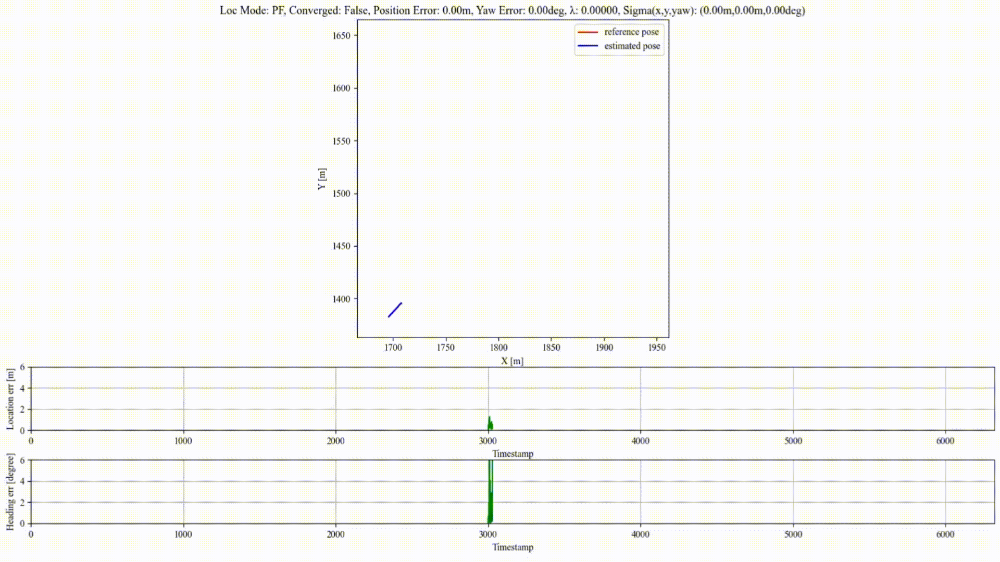
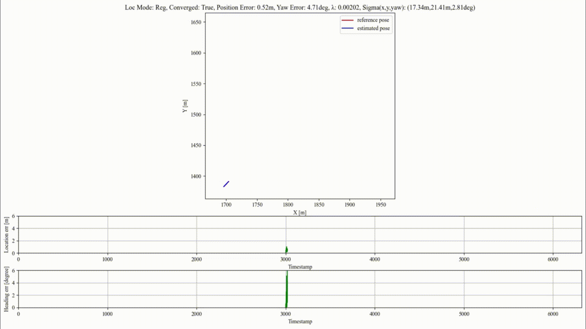
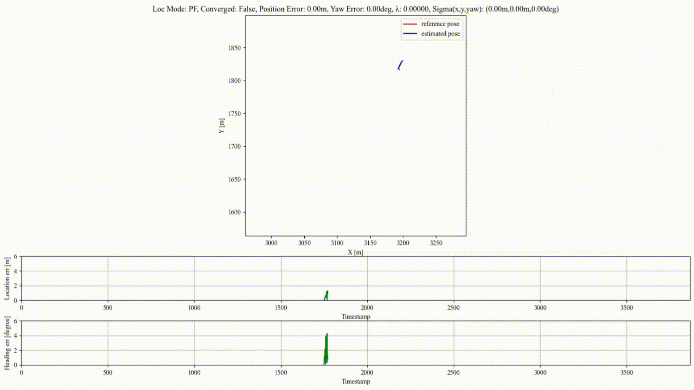

# Reliable-loc
Reliable point cloud global localization using geometric verification and pose uncertainty. The implementation is based on PatchAugNet and Overlap-loc

Source code is coming soon！

# Experimental results of Reliable-loc on 6 data
## CS college

## Info campus

## Zhongshan park

## Jiefang road

## Yanjiang road 1

## Yanjiang road 2

# Ablation study: the necessity of switching loc modes
## Clip 1: incomplete map coverage
<table>
  <tr>
    <td>
      
      <strong>Reg-loc</strong>
    </td>
    <td>
      
      <strong>Reliable-loc</strong>
    </td>
  </tr>
</table>

## Clip 2: feature insufficiency
<table>
  <tr>
    <td>
      
      <strong>Reg-loc</strong>
    </td>
    <td>
      
      <strong>Reliable-loc</strong>
    </td>
  </tr>
</table>

## Clip 3: feature insufficiency
<table>
  <tr>
    <td>
      
      <strong>Reg-loc</strong>
    </td>
    <td>
      
      <strong>Reliable-loc</strong>
    </td>
  </tr>
</table>

## Clip 4: feature insufficiency
<table>
  <tr>
    <td>
      
      <strong>Reg-loc</strong>
    </td>
    <td>
      
      <strong>Reliable-loc</strong>
    </td>
  </tr>
</table>

**Note**: Both λ and sigma being zero means that registration based on local features is invalid.
